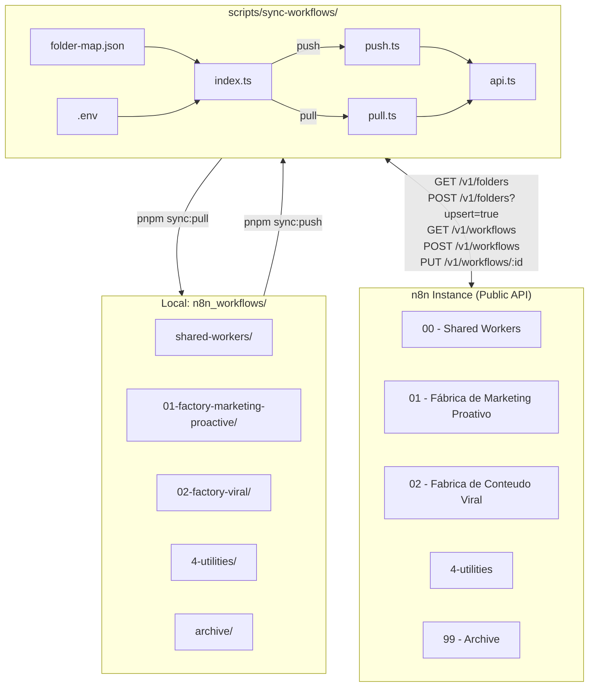

# Workflow Sync CLI — Documentation

> Automate the import and export of n8n workflows between your local repository
> and your n8n instance using the n8n Public API.

---

## Table of Contents

- [Overview](#overview)
- [How It Works](#how-it-works)
- [File Structure](#file-structure)
- [Setup](#setup)
- [Usage](#usage)
- [Folder Mapping](#folder-mapping)
- [Conflict Resolution](#conflict-resolution)
- [Workflow JSON Format](#workflow-json-format)
- [Architecture](#architecture)
- [Command Reference](#command-reference)
- [Troubleshooting](#troubleshooting)

---

## Overview

The `sync-workflows` CLI bridges the gap between:

- **Your local filesystem** — a `n8n_workflows/` directory containing `.json` workflow files organized into subfolders
- **Your running n8n instance** — folders and workflows managed via the n8n Public API

Instead of manually importing/exporting workflows one by one through the n8n UI, you run a single command to sync everything at once.

```
Local disk                         n8n Instance
─────────────────                  ─────────────────────────────────
n8n_workflows/                     Personal Project
  shared-workers/         push →     00 - Shared Workers/
  01-factory-marketing/   ──────→    01 - Fábrica de Marketing Proativo/
  02-factory-viral/                  02 - Fabrica de Conteudo Viral/
  4-utilities/                       4-utilities/
  archive/                           99 - Archive/
```

---

## How It Works

### Push (local → n8n)

1. Reads `folder-map.json` to know which local folder maps to which n8n folder name
2. Fetches all existing folders and workflows from n8n **once** (efficient — not per file)
3. For each local folder:
   - **Creates** the n8n folder if it doesn't exist (upsert — safe to re-run)
   - Reads all `.json` files in that folder
4. For each workflow JSON file:
   - If the file contains an `id` field that matches an existing n8n workflow → **updates** it
   - If the name matches an existing workflow → **updates** it
   - Otherwise → **creates** a new workflow in the correct folder

### Pull (n8n → local)

1. Fetches all n8n folders and reverse-maps them to local folder names using `folder-map.json`
2. For each matched folder, fetches all workflows inside it
3. Saves each workflow as a `.json` file — filename is derived from the workflow name
4. Skips files whose content is already identical (no pointless overwrites)

### Diff / Dry Run

Both `push` and `pull` support a `--dry-run` flag that **previews** all planned actions
without writing anything. This is safe to run at any time.

---

## File Structure

```
scripts/
└── sync-workflows/
    ├── index.ts          ← CLI entry point, command routing, .env loading
    ├── push.ts           ← Push logic (local → n8n)
    ├── pull.ts           ← Pull logic (n8n → local)
    ├── api.ts            ← Typed HTTP client for the n8n Public API
    ├── types.ts          ← Shared TypeScript interfaces
    ├── folder-map.json   ← Maps local folder names ↔ n8n folder display names
    ├── package.json      ← Isolated dependencies (picocolors, tsx)
    ├── tsconfig.json     ← TypeScript config
    ├── .env.example      ← Environment variable template (copy to .env)
    └── README.md         ← Quick-start reference
```

Your workflows live here:

```
n8n_workflows/                      ← root (auto-detected relative to repo root)
├── shared-workers/
│   ├── http-helper.json
│   └── error-handler.json
├── 01-factory-marketing-proactive/
│   └── campaign-publisher.json
├── 02-factory-viral/
│   └── viral-content-generator.json
├── 4-utilities/
│   └── cleanup-old-data.json
└── archive/
    └── deprecated-lead-sync.json
```

---

## Setup

### Step 1 — Get an API Key from n8n

1. Open your n8n instance
2. Go to **Settings → API → Create API Key**
3. Copy the generated key

### Step 2 — Create a `.env` file

Copy the template from `scripts/sync-workflows/.env.example`:

```bash
# In the repo root
cp scripts/sync-workflows/.env.example .env
```

Then edit `.env` with your values:

```dotenv
# The base URL of your n8n instance (no trailing slash)
N8N_BASE_URL=http://31.97.16.118:5678

# Your API key from Settings → API
N8N_API_KEY=your-api-key-here

# Optional: restrict to a specific project
# Leave blank to use your Personal project
N8N_PROJECT_ID=
```

> **Note:** The `.env` file can be in the repo root **or** in `scripts/sync-workflows/`.
> The CLI checks both locations. Never commit `.env` to git — it's already in `.gitignore`.

### Step 3 — Install Dependencies

From the repo root:

```bash
pnpm install
```

Or from the script directory:

```bash
cd scripts/sync-workflows
pnpm install
```

### Step 4 — Create the `n8n_workflows/` Directory

Create the directory in the repo root with subfolders matching the keys in `folder-map.json`:

```bash
mkdir -p n8n_workflows/01-factory-marketing-proactive
mkdir -p n8n_workflows/02-factory-viral
mkdir -p n8n_workflows/shared-workers
mkdir -p n8n_workflows/4-utilities
mkdir -p n8n_workflows/archive
```

Place your exported workflow `.json` files into the appropriate folder.

---

## Usage

All commands are run from the **repo root** using `pnpm`:

### Preview (always start here!)

```bash
pnpm sync:diff
```

Shows what would be created or updated without making any changes. No API calls that write data.

### Push — local → n8n

```bash
# Dry run: preview only
pnpm sync:push --dry-run

# Push all mapped folders (archive excluded by default)
pnpm sync:push

# Also push the archive folder
pnpm sync:push --include-archive

# Use a custom workflows directory
pnpm sync:push --dir /path/to/my-workflows
```

### Pull — n8n → local

```bash
# Dry run: preview only
pnpm sync:pull --dry-run

# Pull all mapped folders into n8n_workflows/
pnpm sync:pull

# Also pull the archive folder
pnpm sync:pull --include-archive
```

### Example Output

```
🔄 n8n Workflow Sync
  Workflows dir : H:\Projects\n8n\n8n_workflows

→ Fetching existing n8n folders...
→ Fetching existing n8n workflows...
  Found 4 folders, 28 workflows in n8n

📁 shared-workers → 00 - Shared Workers (3 files)
  · Folder exists: 00 - Shared Workers (id: abc123)
  ✓ Updated: HTTP Helper (id: wf_001)
  ✓ Updated: Error Handler (id: wf_002)
  – Unchanged: Slack Notifier

📁 01-factory-marketing-proactive → 01 - Fábrica de Marketing Proativo (2 files)
  · Folder exists: 01 - Fábrica de Marketing Proativo (id: def456)
  ✓ Created: New Campaign Automation (id: wf_099)
  ✓ Updated: Campaign Publisher (id: wf_012)

PUSH SUMMARY
  Created : 1
  Updated : 3
  Skipped : 1
```

---

## Folder Mapping

The file `scripts/sync-workflows/folder-map.json` defines the mapping between
local directory names and n8n folder display names.

```json
{
  "shared-workers":                 "00 - Shared Workers",
  "01-factory-marketing-proactive": "01 - Fábrica de Marketing Proativo",
  "02-factory-viral":               "02 - Fabrica de Conteudo Viral",
  "4-utilities":                    "4-utilities",
  "archive":                        "99 - Archive"
}
```

| Key (left) | Value (right) |
|---|---|
| Local subfolder name within `n8n_workflows/` | n8n folder display name |
| Must match an actual directory on disk | Created in n8n if it doesn't exist |
| English / kebab-case convention | Any string, including Portuguese/accents |

**To add a new folder:**
1. Create the directory: `mkdir n8n_workflows/my-new-folder`
2. Add the mapping to `folder-map.json`: `"my-new-folder": "My New Folder"`
3. Run `pnpm sync:push`

---

## Conflict Resolution

### During Push (local → n8n)

| Situation | Behaviour |
|---|---|
| Workflow JSON has an `id` that exists in n8n | ✅ **Update** the existing workflow |
| Workflow JSON has no `id`, but name matches in n8n | ✅ **Update** the existing workflow |
| No match by ID or name | ✅ **Create** new workflow in correct folder |
| n8n folder doesn't exist | ✅ **Create** folder (upsert — safe) |
| Local folder is `archive` | ⚠️ **Skipped** unless `--include-archive` passed |
| Local folder missing from `folder-map.json` | ⚠️ **Skipped** entirely |
| Invalid JSON file | ❌ **Error logged**, continues with next file |

### During Pull (n8n → local)

| Situation | Behaviour |
|---|---|
| Workflow exists locally with identical content | ⏭️ **Skip** (no write) |
| Workflow exists locally with different content | ✅ **Overwrite** with n8n version |
| Workflow doesn't exist locally | ✅ **Save** new `.json` file |
| n8n folder has no entry in `folder-map.json` | ⚠️ **Skip** the folder |

> **Source of truth:** During push, **local files win**. During pull, **n8n wins**.
> There is no automatic bidirectional merge — you control the direction explicitly.

---

## Workflow JSON Format

Any standard n8n workflow export works. The minimum valid file:

```json
{
  "name": "My Workflow",
  "nodes": [],
  "connections": {},
  "settings": {}
}
```

A full exported workflow looks like:

```json
{
  "id": "abc123xyz",
  "name": "Campaign Publisher",
  "nodes": [
    {
      "id": "node-1",
      "name": "Trigger",
      "type": "n8n-nodes-base.scheduleTrigger",
      "parameters": {},
      "position": [250, 300],
      "typeVersion": 1
    }
  ],
  "connections": {},
  "settings": {
    "executionOrder": "v1"
  },
  "active": false
}
```

> **Tip:** Use `pnpm sync:pull` to export existing workflows from your n8n instance
> as properly-formatted JSON files — then edit and push back with `pnpm sync:push`.

---

## Architecture



### Key Design Decisions

| Decision | Choice | Reason |
|---|---|---|
| **Trigger** | Manual (`pnpm` command) | Simple, explicit, zero infrastructure |
| **Direction** | Explicit push or pull | Avoids accidental data loss from auto-merge |
| **Conflict strategy** | Overwrite (direction wins) | Local is source of truth on push; n8n on pull |
| **Folder matching** | Explicit `folder-map.json` | Handles multilingual names (EN local ↔ PT n8n) |
| **Workflow identity** | ID first, name fallback | Works for both exports and hand-written files |
| **Archive** | Excluded by default | Protects archive from accidental bulk syncs |
| **Language** | TypeScript | Native to the monorepo, reuses types |

---

## Command Reference

### Root `package.json` scripts

| Command | What it does |
|---|---|
| `pnpm sync:push` | Push local workflows → n8n |
| `pnpm sync:pull` | Pull n8n workflows → local files |
| `pnpm sync:diff` | Dry-run push: preview without changes |

### Flags

| Flag | Applies to | Description |
|---|---|---|
| `--dry-run` | push, pull | Preview all actions, make no changes |
| `--include-archive` | push, pull | Include the `archive` folder |
| `--dir <path>` | push, pull | Override the `n8n_workflows/` directory path |

### Environment Variables

| Variable | Required | Description |
|---|---|---|
| `N8N_BASE_URL` | ✅ | Base URL of your n8n instance, e.g. `http://localhost:5678` |
| `N8N_API_KEY` | ✅ | API key from **Settings → API** in n8n |
| `N8N_PROJECT_ID` | Optional | Scope syncs to a specific project (leave blank for Personal) |

---

## Troubleshooting

### `N8N_BASE_URL is not set`
Create a `.env` file in the repo root (copy `.env.example`).

### `401 Unauthorized` from API
Your `N8N_API_KEY` is invalid or expired. Generate a new key in n8n under **Settings → API**.

### `404 Not Found` on workflow update
The workflow `id` in your local JSON no longer exists in n8n (may have been deleted).
Remove the `id` field from the JSON — the sync will re-create it by name.

### Workflow appears in wrong folder
Check `folder-map.json` — ensure the local folder key exactly matches the directory name
(case-sensitive on Linux/macOS).

### `Failed to parse <file>.json`
The JSON file is malformed. Validate it with:
```bash
node -e "JSON.parse(require('fs').readFileSync('<file>.json','utf8'))"
```

### Folders not being created automatically
Verify your API key has the `folder:create` scope enabled in n8n.

### Nothing happens / script exits immediately
Run with `--dry-run` to see what the script sees. Ensure your local `n8n_workflows/`
directory exists and contains `.json` files in subfolders that match `folder-map.json`.
